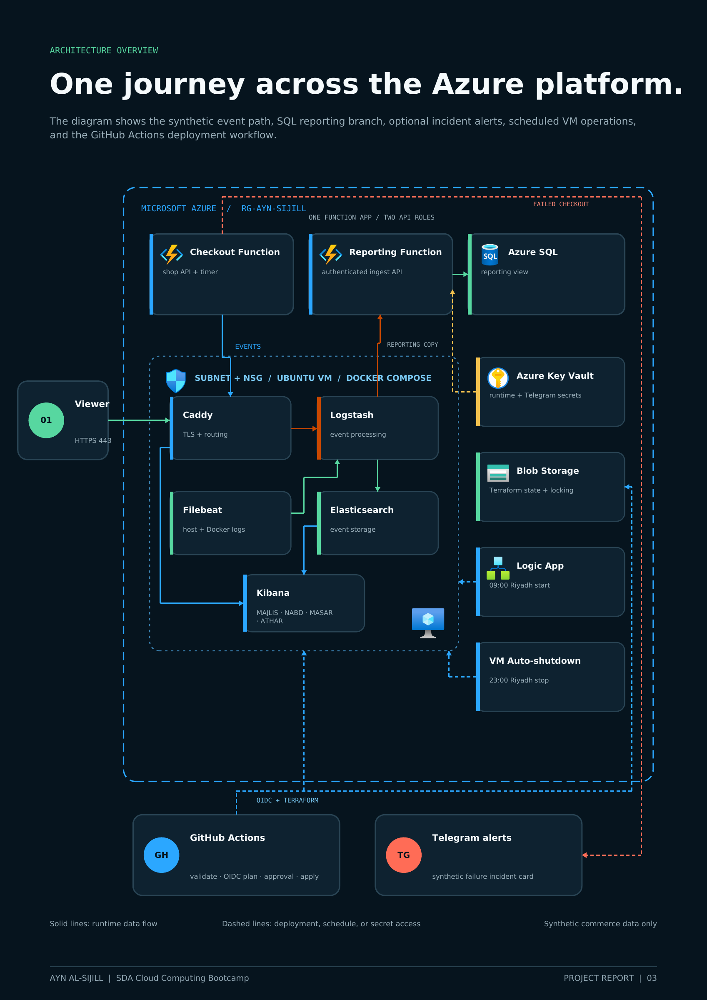

# AYN AL-SIJILL

**Follow the checkout. Find the missing order.**

A payment can be authorized while order creation fails. AYN AL-SIJILL demonstrates how correlated events make that hidden failure visible, give investigators its context, and provide a structured reporting copy.

Built on Azure with Terraform, Azure Functions, and the Elastic Stack. All customer journeys and payment events are synthetic.

[Read the project report](report/output/AYN_AL_SIJILL_Project_Report_Final.pdf)

## The checkout story

The simulator produces successful checkouts, Ghost Orders, declined payments, and inventory shortages. Shared order, trace, and transaction identifiers connect each journey in Elasticsearch. Kibana provides four investigation views; Azure SQL stores a queryable reporting copy. Optional Telegram cards link failed scenarios to their evidence.

The Ghost Order example combines `PAYMENT_SUCCESS`, `ORDER_CREATE_FAILED`, and `DATABASE_TIMEOUT` under the same trace. This is a demonstration of event correlation and scenario alerting, with a reporting foundation for later analysis.

## Architecture

[](report/output/AYN_AL_SIJILL_Project_Report_Final.pdf)

Azure Functions sends checkout events through Caddy and Logstash into Elasticsearch. Filebeat adds host and container logs through Logstash. Kibana supports investigation, and a reporting Function copies events to Azure SQL. Terraform provisions the environment and stores its state in Azure Blob Storage.

The Logic App starts the VM at 09:00 Riyadh time. VM auto-shutdown deallocates it at 23:00.

## Delivery and validation

- Infrastructure and configuration are defined in Terraform, cloud-init, and Docker Compose.
- GitHub Actions validates the Function package, shell syntax, Terraform, and Compose. Azure deployment uses OIDC and is enabled separately.
- Deployment smoke checks exercise a successful checkout and a forced Ghost Order, then check their correlated events.
- Historical journeys use stable event IDs so reruns do not duplicate the reporting baseline.

The deployed system is a single-VM observability demo. Its documented limits and operational checks are in [DEPLOYMENT.md](DEPLOYMENT.md).

## What gets deployed

| Component | Purpose |
| --- | --- |
| Azure Functions | Generates checkout journeys and exposes the reporting API |
| Azure VM with Caddy, Logstash, Elasticsearch, Kibana, and Filebeat | Receives, stores, and presents operational events and host logs |
| Azure SQL | Stores a queryable reporting copy |
| Azure Key Vault | Stores runtime and optional Telegram credentials |
| Logic App and shutdown schedule | Starts the VM at 09:00 and deallocates it at 23:00 Riyadh time |
| Azure Blob Storage | Holds the remote Terraform state with locking |

Public traffic uses HTTPS. Kibana requires a login, and port 22 is not exposed. VM administration and validation use Azure Run Command.

## Deploy from a fresh Azure subscription

The only Azure assumption is that the Azure CLI is authenticated and the intended subscription is selected. Terraform uses that CLI session.

Required tools: Azure CLI, Terraform 1.10 or later, `jq`, `curl`, OpenSSH, Node.js 22 with npm, and standard GNU command-line tools. WSL and Azure Cloud Shell are supported.

```bash
az account show --query '{name:name,id:id,tenant:tenantId}' -o table
./deploy.sh
```

`deploy.sh` prepares account-specific inputs, registers Azure providers, creates or reconnects the remote state backend, installs and tests the Function package, checks the Terraform plan, deploys the infrastructure, publishes the Function, validates the full Azure path, loads the historical dashboard baseline, and prints the non-sensitive outputs.

The script blocks any plan containing a delete or replacement unless you explicitly approve it:

```bash
ALLOW_DESTROY=true ./deploy.sh
```

Other optional controls are `PLAN_ONLY=true`, `SKIP_TESTS=true`, and `SKIP_BACKFILL=true`.

For Telegram alerts, export the external bot token before deployment. If it is absent, the rest of the deployment still completes.

```bash
read -rsp "Telegram bot token: " TELEGRAM_BOT_TOKEN && export TELEGRAM_BOT_TOKEN
echo
./deploy.sh
unset TELEGRAM_BOT_TOKEN
```

In Azure Cloud Shell, clone this repository, enter its directory, confirm `az account show`, and run `./deploy.sh`.

Azure permissions, quota, and regional service availability still apply. The signed-in identity must be able to create resources, register providers, and create the VM startup role assignment. Owner access is the simplest choice for a disposable demo subscription.

## Find the deployed URLs and credentials

The deployment prints non-sensitive Terraform outputs at the end. You can display them again with:

```bash
source .deployment/session.sh
terraform -chdir=terraform output
```

Open `kibana_dashboard_url` and sign in with `elastic_username` and the explicitly requested password:

```bash
terraform -chdir=terraform output -raw elastic_password
```

The complete output inventory is documented in [DEPLOYMENT.md](DEPLOYMENT.md#post-deployment-outputs).

Generated credentials are marked sensitive and are redacted from normal Terraform and CI output. Terraform state still contains them and must remain private.

## Local checks

The application does not run locally. These commands validate its code and configuration:

```bash
. "$HOME/.nvm/nvm.sh" && nvm use default
npm test
make validate
```

`make validate` requires Docker and Terraform. The application tests require Node.js 22 or later and Bash/GNU tooling in WSL or Linux.

## More detail

- [DEPLOYMENT.md](DEPLOYMENT.md): operations, validation, output inventory, Telegram, backfill, and teardown
- [docs/CI_CD.md](docs/CI_CD.md): GitHub Actions, Azure OIDC, approvals, and one-time setup
- [docs/ARCHITECTURE.md](docs/ARCHITECTURE.md): components and data flow
- [docs/EVENTS.md](docs/EVENTS.md): event and failure-scenario catalogue
- [docs/DESIGN_DECISIONS.md](docs/DESIGN_DECISIONS.md): infrastructure decisions and tradeoffs

## Team

Built by Saud, Retaj, Norah, and Lama through the SDA Cloud Computing Bootcamp. [Meet the team](https://sda-team-collective.vercel.app).
