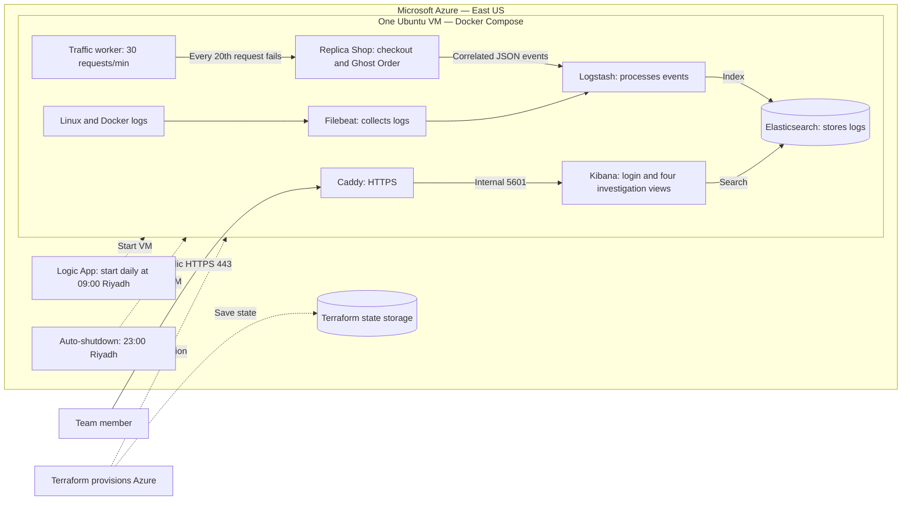

# Replica Shop / AYN AL-SIJILL

The application and ELK stack run on one Azure VM in East US. The startup workflow runs outside the VM, so it can start a deallocated host. Times below are Riyadh time (UTC+3).

- **Public access:** the team opens Kibana through Caddy over HTTPS and signs in. Port 80 redirects to HTTPS and handles certificate validation.
- **Restricted access:** SSH (22) and the replica API (3000) accept only the configured IP range. Kibana (5601) is internal; Elasticsearch (9200) is available only on the VM loopback interface; Logstash is not published.
- **Demo workload:** one Node process simulates checkout, inventory, payment, order and database events. There is no real payment processor or commerce database.
- **Correlation:** `order.id`, `trace.id` and `transaction.id` connect the event sequence. Every twentieth request deliberately produces a Ghost Order.
- **Investigation views:** MAJLIS, NABD, MASAR and ATHAR are saved searches in the Operations dashboard.
- **Startup:** the Logic App requests VM startup at 09:00. Docker restarts the services; allow a few minutes for readiness. The VM deallocates at 23:00.

Terraform also provisions the VM network, access rules, managed identity permissions and startup/shutdown schedules. The diagram omits one-time setup containers for readability. Credentials are intentionally absent from this document.
