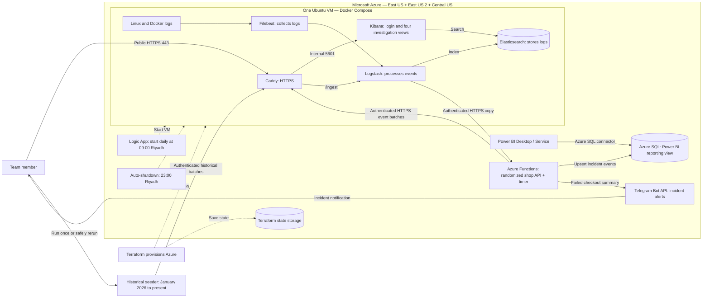

# Replica Shop / AYN AL-SIJILL

The randomized application workload runs on Azure Functions. The ELK stack runs on one Azure VM in East US. The startup workflow runs outside the VM, so it can start a deallocated host. Times below are Riyadh time (UTC+3).

- **Public access:** the team opens Kibana through Caddy over HTTPS and signs in. Port 80 redirects to HTTPS and handles certificate validation.
- **Restricted access:** SSH (22) accepts only the configured IP range. Kibana (5601) is internal; Elasticsearch (9200) is available only on the VM loopback interface; Logstash is reachable only through Caddy's authenticated `/ingest` route. The Function APIs require generated tokens except for health.
- **Demo workload:** a timer-triggered Function selects a weighted scenario and an HTTP-triggered Function supports manual checkouts. There is no real payment processor or commerce database.
- **Correlation:** `order.id`, `trace.id` and `transaction.id` connect each randomized event sequence. A dedicated endpoint still produces a repeatable Ghost Order.
- **Investigation views:** MAJLIS, NABD, MASAR and ATHAR are saved searches in the Operations dashboard.
- **Reporting:** Logstash retains operational events in Elasticsearch and also sends them to the reporting Function, which upserts Azure SQL. Power BI reads `dbo.PowerBIIncidentEvents`.
- **Alerting:** the Function sends a concise Telegram notification for each failed checkout. Bot and chat credentials are resolved from Azure Key Vault; alert delivery cannot fail the checkout request.
- **Historical baseline:** the seeder sends four randomized journeys per day from 1 January 2026 by default. Stable event IDs prevent duplicate Elasticsearch and Azure SQL records on rerun.
- **Startup:** the Logic App requests VM startup at 09:00. Docker restarts the services; allow a few minutes for readiness. The VM deallocates at 23:00.

Terraform also provisions the VM network, access rules, managed identity permissions and startup/shutdown schedules. The diagram omits one-time setup containers for readability. Credentials are intentionally absent from this document.
